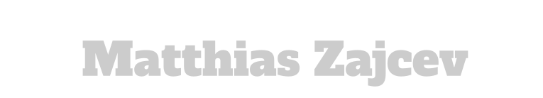

<p align="center">
  
  
</p>

<div>
<h3 align="center">Hello and Welcome to my GitHub Profile </h3>
  
```python
class DataAnalyst:

    def __init__(self):
        self.current_role = "Data Analyst"
        self.code_skills = ["HTML", "CSS", "JavaScript", "PHP", "Python", "SQL"]
        self.tools = ["Snowflake SQL", "Apache Superset", "PowerBI", "SPSS", "Pandas", "spaCy", "Langchain", "Transformers", "Scikit-learn", "Wordpress", "& many more"]
        self.architecture = ["event-driven", "microservice", "pipeline", "data lake"]
        self.interests = {
            "NLP": [
                  "Sentiment Analysis",
                  "Topic Modeling",
                  "LLMs"
            ],
            "ML": [
                "Predictive Modeling", 
                "Data Mining", 
                "Clustering Algorithms", 
                "Dimensionality Reduction", 
                "Embeddings"
            ]
        }

    def say_hi(self):
        print("My name is Matthias Zajcev and I am from Cologne, Germany. I'm a University of Applied Sciences Cologne graduate and currently focussing on my Masters degree. I love to extend and generate new knowledge in various fields to become an expert in Data Science with focus on Natural Language Processing and Machine Learning.")

matthias = DataAnalyst()
matthias.say_hi()
```
<p align="left">
  My name is Matthias Zajcev and I am from Cologne, Germany. 
  I'm a University of Applied Sciences Cologne graduate and currently focusing on my Masters degree.
  I love to extend and generate new knowledge in various fields to become an expert in Data Science with focus on Natural Language Processing and Machine Learning.
</p>

<br>
<h4 align="center">Additional information:</h4>

```python
🔭 I’m currently working on clustering unsupervised data with reduced dimensionality to discover knowledge in a business setting.
👯 I’m looking to collaborate on anything in the direction of NLP / ML.
💬 Ask me about anything!
📫 How to reach me: Preferably on LinkedIn.
⚡ Fun fact: I adore caffeine and cats.
```
<br>

<h4 align="center">My (and probably everyones) Eternal Triangle:</h4>
<p align="center">
  
</p>
